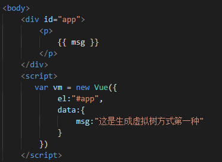
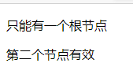
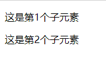
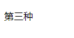
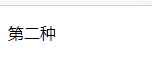

# vue生成虚拟树的方式

1.在挂载的元素内部直接书写，此时使用元素的outerhtml作为模板。

.png)

2.在template的配置中写。

.png)

.png)

但是请注意，模板只能有一个根节点。

.png)

.png)

如果需要配置多个元素，请使用div将元素包含进去。

.png)

3.在render配置中用函数直接创建虚拟节点树，此时完全脱离模板，将省略编译步骤。

.png)

.png)

绑定数据

.png)

.png)

每个模板都只能有一个根节点，所以当使用此方法创建子元素时需要用数组

.png)

优先级3>2>1，优先级高的会覆盖掉优先级低的那个

.png)

.png)

