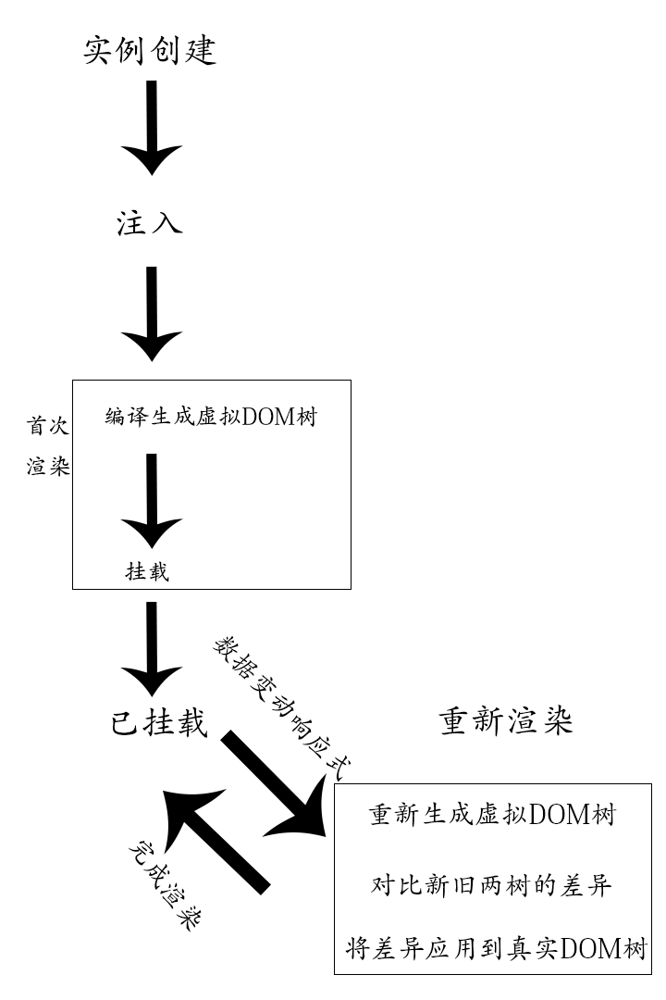

# vue的一些基本功能概念

## 响应式的数据更改是怎么做到的

vue2.0是通过Object.defineProperty方法完成数据响应。

vue3.0是通过class proxy完成的数据响应式，这个是ES6语法。

## 两者的区别

Object无法感知到新增的属性和删除属性等。。。

## vue运行原理

为提高渲染效率，vue会把模板编译成为虚拟DOM树，然后生成真实的DOM树，当数据更改时，虚拟DOM树会与真实DOM树对比差异，仅将差异部分反映到真实DOM树，这样可以最小的改动真实DOM树，提高整体的效率。

## Vue效率的提升

基于Vue的运行原理，要提高Vue的效率。就要最大程度的减少虚拟DOM的生成，保证对比之后只有必要的节点有变化。

## Vue的注入

配置对象部分会被提取到实例中，该过程被称之为注入。
目的：完成数据的响应式，绑定this

## Vue挂载

1、使用el:" css选择器 " 进行配置

2、通过vue实例.$mount(" css 选择器") 进行配置

第二种方法可以实现延迟挂载，也就是先让页面加载需要的东西但是先不显示，当延迟时间到了后，实现一次性挂载显示。

## Vue实例工作流程

